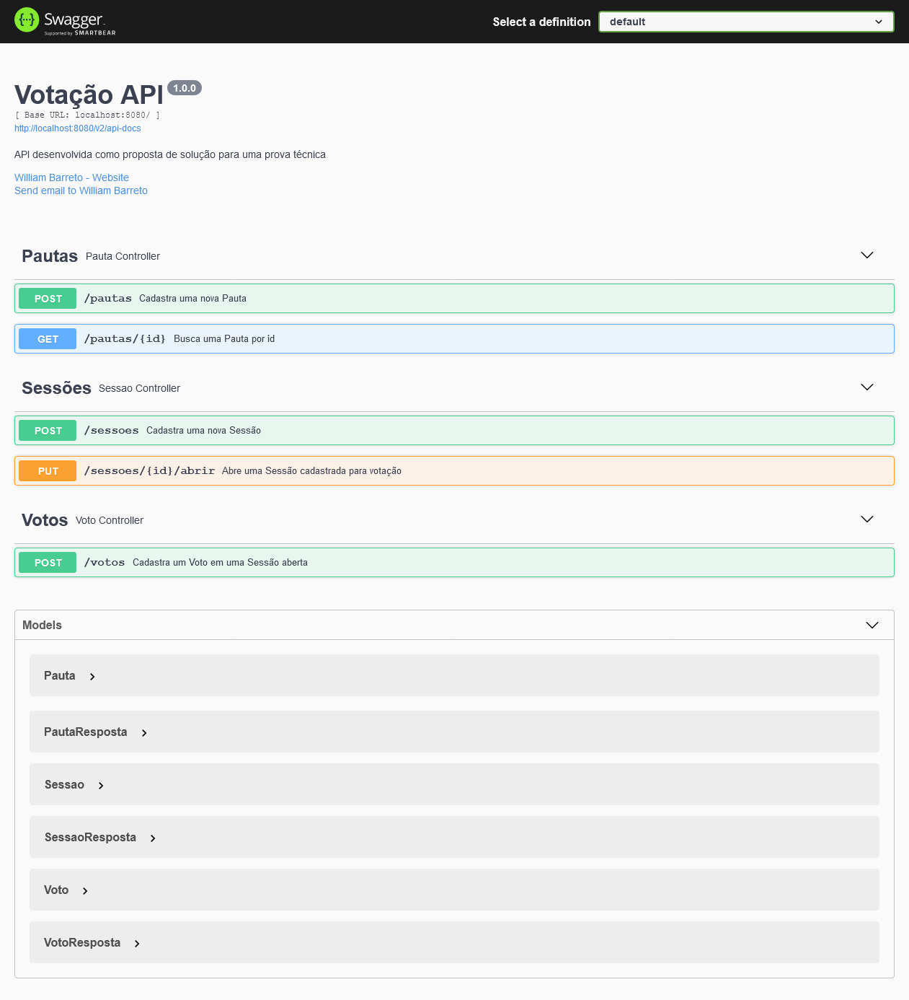
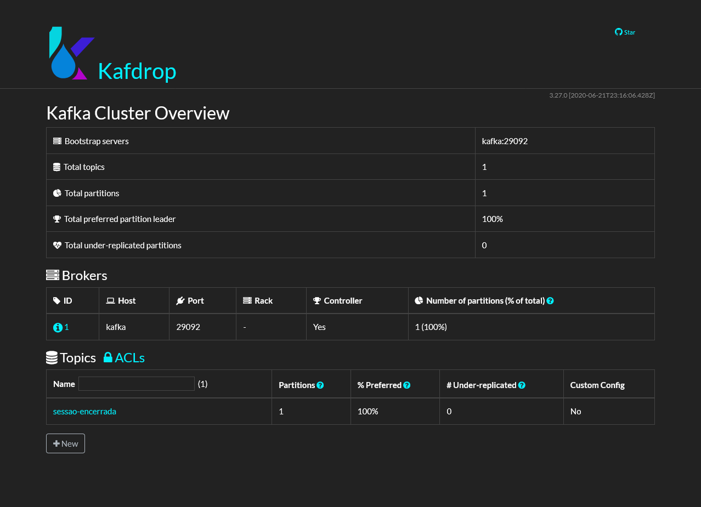
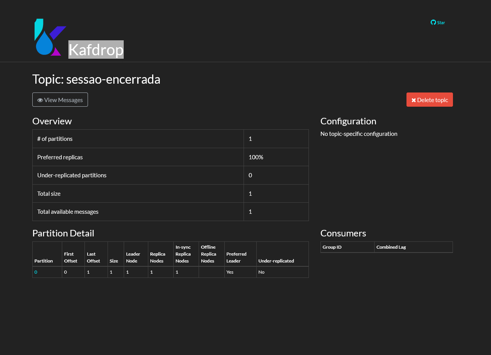
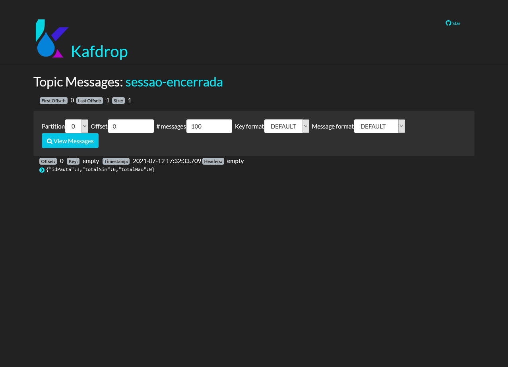

# API Votação - Backend

API desenvolvida para proposta de solução técnica.

## Iniciando

### Pré-requisitos

* Java (11)
* Apache Maven (3.6.3)
* Docker (20.10.7) / Docker Compose (1.29.2)

### Instalando

Baixe o projeto para um diretório local, e execute os seguintes comandos abaixo:

1. Empacotando o projeto 
```
mvn clean package
```

2. Executando build de containers
```
docker-compose build
```

3. Executando containers atráves do docker-compose
```
docker-compose up -d
```
Pronto!

### Documentação da API

* Swagger - http://localhost:8080/swagger-ui/



### Kafdrop

* Dashboard - http://localhost:19000/



* Topic



* Message




